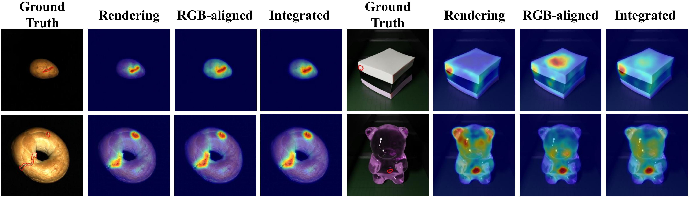

# Align3D-AD
Official code for paper "Align3D-AD: Cross-Modal Feature Alignment and Dual-Prompt Learning for Zero-shot 3D Anomaly Detection"

## Introduction
Zero-shot 3D anomaly detection aims to identify anomalies in unseen categories without accessing their training data. Existing methods typically project 3D point clouds into multi-view renderings and process them with RGB-pretrained vision encoders, resulting in a domain gap between geometric renderings and RGB semantics. To address this issue, we propose Align3D-AD, a two-stage framework that leverages RGB observations from auxiliary categories as cross-modal guidance. In the first stage, Cross-Modal Feature Alignment maps rendering features into the RGB semantic space, refined by Semantic Consistency Reweighting (SCR). In the second stage, Modality-Aware Prompt Learning learns separate normal and anomalous prompts for RGB-aligned and rendering features, enhanced by Dual-Prompt Contrastive Alignment (DpCA). During inference, predictions from both branches are integrated using rendering observations only. Experiments on MVTec3D-AD, Eyecandies, and Real3D-AD demonstrate the effectiveness of Align3D-AD under one-vs-rest and cross-dataset evaluation settings.

## Overview
The overall framework of Align3D-AD is illustrated in the following figure.


## Qualitative Results



Qualitative comparisons on MVTec3D-AD and Eyecandies demonstrate the complementary strengths of rendering and RGB-aligned representations. Rendering features capture geometric and structural anomalies, while RGB-aligned features provide richer semantic cues for precise anomaly localization. Their integration yields more accurate and robust anomaly segmentation.

## Dataset and Pretrained Weights

The datasets and pretrained model weights for Align3D-AD are available on [ModelScope](https://modelscope.cn/models/Bailt123/Align3D-AD).

Download the OpenAI pretrained CLIP weights: [ViT-L-14-336px.pt](https://openaipublic.azureedge.net/clip/models/3035c92b350959924f9f00213499208652fc7ea050643e8b385c2dac08641f02/ViT-L-14-336px.pt).

Place the downloaded file at `./pretrained_weights/ViT-L-14-336px.pt`.

## How to Run

Download the datasets and model weights from [ModelScope](https://modelscope.cn/models/Bailt123/Align3D-AD). Place the CLIP backbone at `pretrained_weights/ViT-L-14-336px.pt` and the model checkpoints under `Model_weights/<dataset>/<category>/weight/`.

Run the following commands from the repository root:

```bash
# Configure the prepared dataset directory and GPU
export DATA_ROOT="/path/to/datasets"
export GPU_DEVICE=0

# Train on an auxiliary category and evaluate
bash train_bash/train_mvtec_cookie.sh

# Evaluate pretrained models
bash test_bash/test_mvtec.sh
bash test_bash/test_eyecandies.sh

# Cross-dataset evaluation
bash test_bash/test_cross_dataset.sh
bash test_bash/test_cross_dataset_only_point.sh
```

Additional category-specific scripts are available in `train_bash/` and `test_bash/`. Evaluation metrics are saved alongside the model checkpoints, and logs are stored in `results/`.

## Acknowledgements

We thank the authors of [PointAD](https://github.com/zqhang/PointAD) and [AnomalyCLIP](https://github.com/zqhang/AnomalyCLIP) for making their code publicly available.


