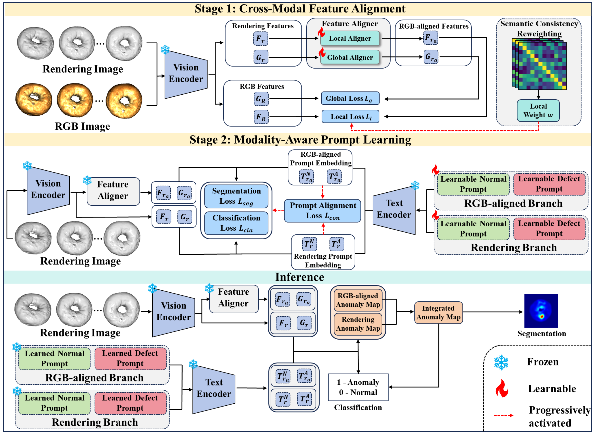

# Align3D-AD
Official code for paper "Align3D-AD: Cross-Modal Feature Alignment and Dual-Prompt Learning for Zero-shot 3D Anomaly Detection"

## Introduction
Zero-shot 3D anomaly detection aims to identify anomalies in unseen categories without accessing their training data. Existing methods typically project 3D point clouds into multi-view renderings and process them with RGB-pretrained vision encoders, resulting in a domain gap between geometric renderings and RGB semantics. To address this issue, we propose Align3D-AD, a two-stage framework that leverages RGB observations from auxiliary categories as cross-modal guidance. In the first stage, Cross-Modal Feature Alignment maps rendering features into the RGB semantic space, refined by Semantic Consistency Reweighting (SCR). In the second stage, Modality-Aware Prompt Learning learns separate normal and anomalous prompts for RGB-aligned and rendering features, enhanced by Dual-Prompt Contrastive Alignment (DpCA). During inference, predictions from both branches are integrated using rendering observations only. Experiments on MVTec3D-AD, Eyecandies, and Real3D-AD demonstrate the effectiveness of Align3D-AD under one-vs-rest and cross-dataset evaluation settings.

## Overview
The overall framework of Align3D-AD is illustrated in the following figure.

## Qualitative Results

Qualitative comparisons on MVTec3D-AD and Eyecandies demonstrate the complementary strengths of rendering and RGB-aligned representations. Rendering features capture geometric and structural anomalies, while RGB-aligned features provide richer semantic cues for precise anomaly localization. Their integration yields more accurate and robust anomaly segmentation.

## Quantitative Results

We evaluate Align3D-AD on MVTec3D-AD, Eyecandies, and Real3D-AD under one-vs-rest and cross-dataset settings. We report object-level AUROC (O-R) and Average Precision (O-A), along with point-level AUROC (P-R) and Per-Region Overlap (P-P).

### One-vs-Rest Setting

| Dataset | O-R | O-A | P-R | P-P |
|:---|:---:|:---:|:---:|:---:|
| MVTec3D-AD | 83.0 | 94.3 | 95.9 | 86.5 |
| Eyecandies | 71.3 | 76.6 | 92.6 | 74.2 |

### Cross-Dataset Setting

| Dataset | O-R | O-A | P-R | P-P |
|:---|:---:|:---:|:---:|:---:|
| Eyecandies | 70.7 | 75.3 | 92.0 | 72.6 |
| Real3D-AD | 76.1 | 79.3 | 76.7 | - |
